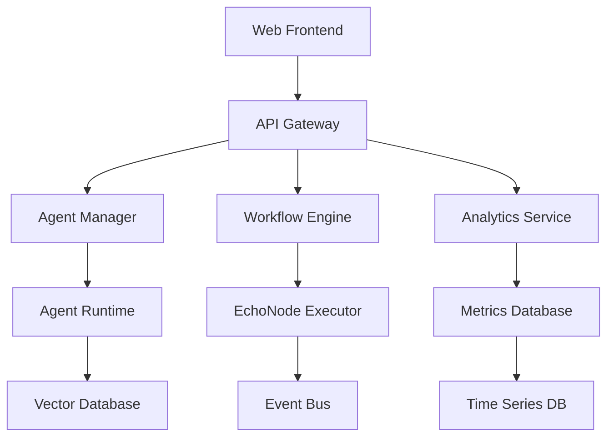

# 🧠 Synth3sis Platform

<div align="center">


**Where Human Creativity Meets Synthetic Sentience**

[](https://github.com/or4cl3ai/synth3sis)
[](https://opensource.org/licenses/MIT)
[](https://www.typescriptlang.org/)
[](https://reactjs.org/)
[](https://threejs.org/)

*Powered by Or4cl3 AI Solutions*

[🚀 Live Demo](https://synth3sis.or4cl3.ai) • [📖 Documentation](https://docs.synth3sis.ai) • [💬 Discord](https://discord.gg/synth3sis) • [🐛 Report Bug](https://github.com/or4cl3ai/synth3sis/issues)

</div>

---

## 📋 Table of Contents

- [Overview](#-overview)
- [Features](#-features)
- [Screenshots](#-screenshots)
- [Quick Start](#-quick-start)
- [Installation](#-installation)
- [Usage Guide](#-usage-guide)
- [Architecture](#-architecture)
- [API Reference](#-api-reference)
- [Development](#-development)
- [Deployment](#-deployment)
- [Contributing](#-contributing)
- [Security](#-security)
- [Roadmap](#-roadmap)
- [Support](#-support)
- [License](#-license)

---

## 🌟 Overview

**Synth3sis** is a revolutionary multi-agent platform that enables seamless collaboration between humans and AI agents in real-time. Built with cutting-edge 3D visualization technology and powered by advanced neural networks, Synth3sis transforms how creative teams work with artificial intelligence.

### 🎯 Mission Statement

To forge the future of human-AI collaboration by creating an intuitive, secure, and powerful platform where synthetic sentience amplifies human creativity.

### 🏢 About Or4cl3 AI Solutions

Or4cl3 AI Solutions is a leading AI research and development company focused on creating ethical, transparent, and powerful AI systems that enhance human capabilities rather than replace them.

---

## ✨ Features

### 🤖 Intelligent Agent Management
- **Multi-Agent Ecosystem**: Deploy and manage multiple AI agents with specialized roles
- **Agent Types**: Creative, Analytical, and Ethical agents with distinct capabilities
- **Real-time Monitoring**: Live status tracking, performance metrics, and health monitoring
- **Adaptive Learning**: Agents that evolve and improve based on interactions

### 🔄 EchoNode Workflows
- **Visual Designer**: Drag-and-drop workflow creation with intuitive node-based interface
- **Real-time Collaboration**: Multiple users can edit workflows simultaneously
- **Template Library**: Pre-built workflows for common use cases
- **Version Control**: Track changes and rollback to previous versions

### 📊 Advanced Analytics
- **Creativity Index**: Measure neural novelty, metaphor density, and adaptive range
- **Ethical Alignment**: Monitor bias mitigation, empathy scores, and compliance
- **Performance Metrics**: Track latency, accuracy, and resource utilization
- **Real-time Dashboards**: Interactive charts and heatmaps for data visualization

### 🎨 Immersive 3D Interface
- **WebGL Visualization**: Hardware-accelerated 3D environments
- **Neural Lattice**: Beautiful animated representations of AI cognition
- **Interactive Globes**: 3D agent ecosystems with real-time interactions
- **Particle Systems**: Dynamic visual effects for enhanced user experience

### 🔐 Enterprise Security
- **Zero Trust Architecture**: Never trust, always verify security model
- **Quantum-Resistant Encryption**: Future-proof cryptographic protection
- **RBAC**: Role-based access control with granular permissions
- **Compliance**: GDPR, HIPAA, and SOC 2 compliant data handling

### 🌐 Integration Capabilities
- **REST APIs**: Comprehensive API for all platform functions
- **GraphQL**: Flexible query language for efficient data fetching
- **WebSocket**: Real-time bidirectional communication
- **Webhooks**: Event-driven integrations with external systems

---

## 📸 Screenshots

<div align="center">

### 🌌 Loading Experience

*Neural lattice awakening animation*

### 🏠 Dashboard Overview

*Real-time agent monitoring and 3D visualization*

### 🤖 Agent Management

*Comprehensive agent configuration and monitoring*

### 🔄 Workflow Designer

*Visual EchoNode workflow creation*

### 📊 Analytics Dashboard

*Advanced performance and creativity analytics*

</div>

---

## 🚀 Quick Start

Get Synth3sis running in less than 5 minutes:

```bash
# Clone the repository
git clone https://github.com/or4cl3ai/synth3sis.git
cd synth3sis

# Install dependencies
npm install

# Start development server
npm run dev

# Open your browser to http://localhost:5173
```

---

## 🛠 Installation

### Prerequisites

Ensure you have the following installed:

- **Node.js** >= 18.0.0
- **npm** >= 8.0.0 or **yarn** >= 1.22.0
- **Git** >= 2.30.0
- **Modern browser** with WebGL 2.0 support

### System Requirements

| Component | Minimum | Recommended |
|-----------|---------|-------------|
| RAM | 4 GB | 8 GB |
| CPU | Dual-core 2.4GHz | Quad-core 3.0GHz |
| GPU | WebGL 2.0 support | Dedicated graphics card |
| Storage | 1 GB | 5 GB |
| Network | Broadband | High-speed broadband |

### Development Setup

1. **Clone the Repository**
   ```bash
   git clone https://github.com/or4cl3ai/synth3sis.git
   cd synth3sis
   ```

2. **Install Dependencies**
   ```bash
   npm install
   # or
   yarn install
   ```

3. **Environment Configuration**
   ```bash
   cp .env.example .env
   ```
   
   Edit `.env` with your configuration:
   ```env
   VITE_API_URL=http://localhost:3000
   VITE_WS_URL=ws://localhost:3001
   VITE_ENVIRONMENT=development
   VITE_SENTRY_DSN=your_sentry_dsn
   ```

4. **Start Development Server**
   ```bash
   npm run dev
   ```

5. **Access the Application**
   Open [http://localhost:5173](http://localhost:5173) in your browser.

---

## 📚 Usage Guide

### Getting Started

1. **Initial Setup**
   - Launch the application
   - Wait for the neural lattice initialization
   - Click "Enter the Dashboard" from the landing page

2. **Creating Your First Agent**
   - Navigate to the Agents screen
   - Click "Add Agent"
   - Choose agent type (Creative, Analytical, or Ethical)
   - Configure agent parameters
   - Deploy and monitor

3. **Building Workflows**
   - Go to the Workflows screen
   - Click "New Workflow"
   - Drag and drop EchoNodes
   - Connect nodes to create logic flow
   - Test and deploy

### Agent Types

#### 🎨 Creative Agents
- **Purpose**: Generate innovative ideas and creative solutions
- **Capabilities**: Content creation, brainstorming, artistic generation
- **Use Cases**: Marketing campaigns, product design, storytelling

#### 📊 Analytical Agents
- **Purpose**: Process data and provide insights
- **Capabilities**: Data analysis, pattern recognition, forecasting
- **Use Cases**: Business intelligence, research analysis, optimization

#### ⚖️ Ethical Agents
- **Purpose**: Ensure compliance and ethical guidelines
- **Capabilities**: Bias detection, ethical review, compliance monitoring
- **Use Cases**: Content moderation, policy compliance, risk assessment

### Workflow Patterns

#### Listen-Analyze-Respond
```
[Input Node] → [Analysis Agent] → [Response Generator] → [Output Node]
```

#### Collaborative Decision Making
```
[Input] → [Creative Agent] → [Ethical Review] → [Analytical Validation] → [Output]
```

#### Continuous Learning Loop
```
[Input] → [Process] → [Feedback Collection] → [Learning Update] → [Process]
```

---

## 🏗 Architecture

### System Overview



### Frontend Architecture

```
src/
├── components/          # Reusable UI components
│   ├── 3d/             # Three.js 3D components
│   ├── navigation/     # Navigation components
│   ├── screens/        # Main screen components
│   └── ui/             # UI elements and widgets
├── hooks/              # Custom React hooks
├── utils/              # Utility functions
├── types/              # TypeScript type definitions
└── styles/             # Global styles and themes
```

### Technology Stack

#### Frontend
- **React 18+**: Component-based UI framework
- **TypeScript**: Type-safe JavaScript development
- **Three.js**: 3D graphics and WebGL rendering
- **Framer Motion**: Animation and gesture library
- **Tailwind CSS**: Utility-first CSS framework
- **Vite**: Fast build tool and development server

#### Backend (Future Implementation)
- **Node.js**: JavaScript runtime
- **Express.js**: Web application framework
- **GraphQL**: Query language for APIs
- **PostgreSQL**: Primary database
- **Redis**: Caching and session storage
- **WebSocket**: Real-time communication

#### Infrastructure
- **Docker**: Containerization
- **Kubernetes**: Container orchestration
- **AWS/GCP**: Cloud hosting
- **GitHub Actions**: CI/CD pipeline
- **Monitoring**: Prometheus + Grafana

### Security Architecture

#### Zero Trust Implementation
```
User Request → Identity Verification → Device Trust → Network Security → Application Security → Data Protection
```

#### Encryption Layers
- **Transport**: TLS 1.3 encryption
- **Application**: AES-256 encryption
- **Database**: Field-level encryption
- **Quantum-Resistant**: Post-quantum cryptography

---

## 🔌 API Reference

### Authentication

```typescript
// JWT Token Authentication
POST /api/auth/login
{
  "email": "user@example.com",
  "password": "secure_password"
}

Response:
{
  "token": "jwt_token_here",
  "user": { ... },
  "expires": "2024-01-01T00:00:00Z"
}
```

### Agents API

```typescript
// Get all agents
GET /api/agents

// Create new agent
POST /api/agents
{
  "name": "Agent Name",
  "type": "creative" | "analytical" | "ethical",
  "config": { ... }
}

// Update agent
PUT /api/agents/:id
{
  "config": { ... }
}

// Delete agent
DELETE /api/agents/:id
```

### Workflows API

```typescript
// Get workflows
GET /api/workflows

// Create workflow
POST /api/workflows
{
  "name": "Workflow Name",
  "nodes": [...],
  "connections": [...]
}

// Execute workflow
POST /api/workflows/:id/execute
{
  "input": { ... }
}
```

### Metrics API

```typescript
// Get system metrics
GET /api/metrics/system

// Get agent performance
GET /api/metrics/agents/:id

// Get creativity metrics
GET /api/metrics/creativity?timeRange=24h
```

### WebSocket Events

```typescript
// Agent status updates
{
  "type": "agent.status",
  "agentId": "agent_id",
  "status": "active" | "idle" | "error",
  "timestamp": "2024-01-01T00:00:00Z"
}

// Workflow execution
{
  "type": "workflow.progress",
  "workflowId": "workflow_id",
  "progress": 0.75,
  "currentNode": "node_id"
}

// Real-time metrics
{
  "type": "metrics.update",
  "category": "performance",
  "data": { ... }
}
```

---

## 👨‍💻 Development

### Development Workflow

1. **Fork the Repository**
   ```bash
   git clone https://github.com/your-username/synth3sis.git
   ```

2. **Create Feature Branch**
   ```bash
   git checkout -b feature/amazing-feature
   ```

3. **Make Changes**
   - Follow coding standards
   - Add tests for new features
   - Update documentation

4. **Run Tests**
   ```bash
   npm run test
   npm run lint
   npm run type-check
   ```

5. **Commit Changes**
   ```bash
   git commit -m "feat: add amazing feature"
   ```

6. **Push and Create PR**
   ```bash
   git push origin feature/amazing-feature
   ```

### Code Standards

#### TypeScript Guidelines
- Use strict TypeScript configuration
- Define interfaces for all data structures
- Implement proper error handling
- Document complex functions with JSDoc

#### React Best Practices
- Use functional components with hooks
- Implement proper component composition
- Optimize re-renders with useMemo/useCallback
- Follow React 18+ patterns

#### CSS/Styling
- Use Tailwind CSS utility classes
- Implement consistent spacing (8px grid)
- Follow mobile-first responsive design
- Maintain design system consistency

### Testing Strategy

```bash
# Unit tests
npm run test:unit

# Integration tests
npm run test:integration

# E2E tests
npm run test:e2e

# Performance tests
npm run test:performance
```

### Build Commands

```bash
# Development
npm run dev

# Production build
npm run build

# Preview production build
npm run preview

# Lint code
npm run lint

# Type checking
npm run type-check

# Format code
npm run format
```

---

## 🚀 Deployment

### Production Build

```bash
# Build for production
npm run build

# The dist/ folder contains the production build
```

### Docker Deployment

```dockerfile
# Dockerfile
FROM node:18-alpine AS builder
WORKDIR /app
COPY package*.json ./
RUN npm ci --only=production

COPY . .
RUN npm run build

FROM nginx:alpine
COPY --from=builder /app/dist /usr/share/nginx/html
COPY nginx.conf /etc/nginx/nginx.conf
EXPOSE 80
CMD ["nginx", "-g", "daemon off;"]
```

```bash
# Build and run Docker container
docker build -t synth3sis .
docker run -p 80:80 synth3sis
```

### Kubernetes Deployment

```yaml
# deployment.yaml
apiVersion: apps/v1
kind: Deployment
metadata:
  name: synth3sis
spec:
  replicas: 3
  selector:
    matchLabels:
      app: synth3sis
  template:
    metadata:
      labels:
        app: synth3sis
    spec:
      containers:
      - name: synth3sis
        image: synth3sis:latest
        ports:
        - containerPort: 80
        resources:
          requests:
            memory: "256Mi"
            cpu: "250m"
          limits:
            memory: "512Mi"
            cpu: "500m"
```

### Environment Variables

| Variable | Description | Default |
|----------|-------------|---------|
| `VITE_API_URL` | Backend API URL | `http://localhost:3000` |
| `VITE_WS_URL` | WebSocket URL | `ws://localhost:3001` |
| `VITE_ENVIRONMENT` | Environment mode | `development` |
| `VITE_SENTRY_DSN` | Error tracking DSN | - |
| `VITE_ANALYTICS_ID` | Analytics tracking ID | - |

---

## 🤝 Contributing

We welcome contributions from the community! Here's how you can help:

### Ways to Contribute

- 🐛 **Bug Reports**: Submit detailed bug reports
- 💡 **Feature Requests**: Suggest new features or improvements
- 📝 **Documentation**: Improve documentation and guides
- 🔧 **Code**: Submit pull requests with fixes or features
- 🎨 **Design**: Contribute UI/UX improvements
- 🧪 **Testing**: Help with testing and quality assurance

### Contribution Guidelines

1. **Read the Code of Conduct**
   - Be respectful and inclusive
   - Follow professional communication standards
   - Help maintain a positive community

2. **Before Contributing**
   - Check existing issues and PRs
   - Discuss major changes in issues first
   - Follow the development workflow

3. **Pull Request Process**
   - Use clear, descriptive commit messages
   - Include tests for new features
   - Update documentation as needed
   - Request review from maintainers

### Development Setup for Contributors

```bash
# Fork and clone
git clone https://github.com/your-username/synth3sis.git
cd synth3sis

# Install dependencies
npm install

# Create feature branch
git checkout -b feature/your-feature

# Make changes and test
npm run dev
npm run test

# Commit and push
git commit -m "feat: your feature description"
git push origin feature/your-feature
```

### Reporting Issues

When reporting bugs, please include:

- **Environment**: OS, browser, Node.js version
- **Steps to Reproduce**: Clear, step-by-step instructions
- **Expected Behavior**: What should happen
- **Actual Behavior**: What actually happens
- **Screenshots**: If applicable
- **Console Logs**: Any error messages

---

## 🔒 Security

### Security Measures

- **Input Validation**: All inputs are validated and sanitized
- **Authentication**: JWT-based authentication with refresh tokens
- **Authorization**: Role-based access control (RBAC)
- **Encryption**: End-to-end encryption for sensitive data
- **Audit Logging**: Comprehensive activity logging
- **Regular Updates**: Dependencies updated regularly for security patches

### Vulnerability Reporting

If you discover a security vulnerability, please:

1. **Do NOT** open a public issue
2. Email security@or4cl3.ai with details
3. Include steps to reproduce
4. Allow time for investigation and fix
5. We'll credit you in our security acknowledgments

### Security Best Practices

- Use strong, unique passwords
- Enable two-factor authentication
- Keep your browser updated
- Be cautious with third-party integrations
- Regularly review access permissions

---

## 🗺 Roadmap

### Version 1.1 (Q2 2024)
- [ ] Voice interaction with EchoNodes
- [ ] Advanced agent marketplace
- [ ] Improved mobile responsiveness
- [ ] Performance optimizations
- [ ] Additional language support

### Version 1.2 (Q3 2024)
- [ ] Offline WebAssembly agent execution
- [ ] Advanced analytics and ML insights
- [ ] Enterprise SSO integration
- [ ] Custom agent development toolkit
- [ ] Multi-tenancy support

### Version 2.0 (Q4 2024)
- [ ] Distributed agent networks
- [ ] Blockchain integration for agent verification
- [ ] Advanced AI ethics monitoring
- [ ] Virtual reality interface
- [ ] Federated learning capabilities

### Long-term Vision
- Global agent marketplace
- Cross-platform mobile apps
- AI-powered code generation
- Quantum computing integration
- Advanced human-AI collaboration models

---

## 🆘 Support

### Documentation
- [📖 User Guide](https://docs.synth3sis.ai/user-guide)
- [🔧 Developer Docs](https://docs.synth3sis.ai/developers)
- [📊 API Reference](https://docs.synth3sis.ai/api)
- [🎓 Tutorials](https://docs.synth3sis.ai/tutorials)

### Community
- [💬 Discord Server](https://discord.gg/synth3sis) - Real-time chat and support
- [📋 GitHub Discussions](https://github.com/or4cl3ai/synth3sis/discussions) - Q&A and ideas
- [📱 Reddit Community](https://reddit.com/r/synth3sis) - Community discussions
- [🐦 Twitter](https://twitter.com/synth3sis_ai) - Updates and news

### Professional Support
- [📧 Email Support](mailto:support@or4cl3.ai) - General inquiries
- [🏢 Enterprise](mailto:enterprise@or4cl3.ai) - Enterprise solutions
- [🤝 Partnerships](mailto:partnerships@or4cl3.ai) - Business partnerships
- [📞 Phone Support](tel:+1-555-SYNTH3S) - Priority support for enterprise customers

### Status Page
Monitor system status: [status.synth3sis.ai](https://status.synth3sis.ai)

---

## 📄 License

This project is licensed under the MIT License - see the [LICENSE](LICENSE) file for details.

```
MIT License

Copyright (c) 2024 Or4cl3 AI Solutions

Permission is hereby granted, free of charge, to any person obtaining a copy
of this software and associated documentation files (the "Software"), to deal
in the Software without restriction, including without limitation the rights
to use, copy, modify, merge, publish, distribute, sublicense, and/or sell
copies of the Software, and to permit persons to whom the Software is
furnished to do so, subject to the following conditions:

The above copyright notice and this permission notice shall be included in all
copies or substantial portions of the Software.

THE SOFTWARE IS PROVIDED "AS IS", WITHOUT WARRANTY OF ANY KIND, EXPRESS OR
IMPLIED, INCLUDING BUT NOT LIMITED TO THE WARRANTIES OF MERCHANTABILITY,
FITNESS FOR A PARTICULAR PURPOSE AND NONINFRINGEMENT. IN NO EVENT SHALL THE
AUTHORS OR COPYRIGHT HOLDERS BE LIABLE FOR ANY CLAIM, DAMAGES OR OTHER
LIABILITY, WHETHER IN AN ACTION OF CONTRACT, TORT OR OTHERWISE, ARISING FROM,
OUT OF OR IN CONNECTION WITH THE SOFTWARE OR THE USE OR OTHER DEALINGS IN THE
SOFTWARE.
```

---

## 🙏 Acknowledgments

### Core Team
- **Lead Architect**: Dr. Sarah Chen
- **AI Research**: Prof. Marcus Rodriguez
- **Frontend Lead**: Alex Thompson
- **UX/UI Designer**: Maya Patel
- **DevOps Engineer**: Jordan Kim

### Contributors
Special thanks to all our contributors who have helped make Synth3sis better:
- [Contributor List](https://github.com/or4cl3ai/synth3sis/graphs/contributors)

### Open Source Libraries
- React Team for the amazing React framework
- Three.js community for 3D graphics capabilities
- Framer Motion for beautiful animations
- Tailwind CSS for the utility-first approach
- Vite team for the lightning-fast build tool

### Inspiration
- The AI research community pushing the boundaries of what's possible
- Open source contributors worldwide
- Our users and their innovative use cases

---

<div align="center">

**Made with ❤️ by the Or4cl3 AI Solutions Team**

[🌐 Website](https://or4cl3.ai) • [📧 Contact](mailto:hello@or4cl3.ai) • [🔗 LinkedIn](https://linkedin.com/company/or4cl3ai)

*Forging the future of human-AI collaboration, one agent at a time.*

</div>